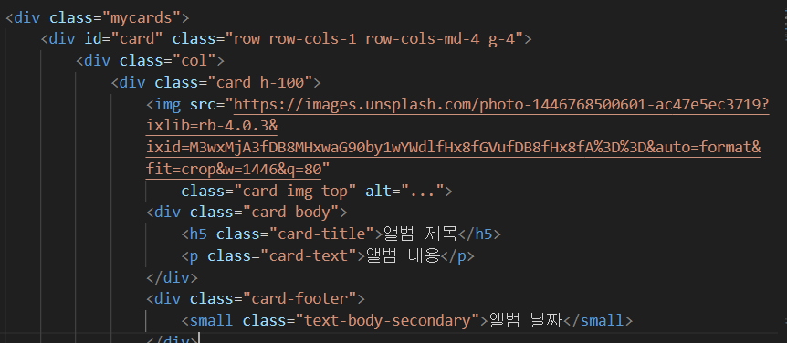

## 구글 폰트 가져오기
---
먼저 구글 폰트를 검색한 후에 마음에 드는 폰트를 골라 import를 가져온다.

```
<style>
    @import url('https://fonts.googleapis.com/css2?family=Black+Han+Sans&family=Gowun+Dodum&display=swap');
    * { // 여기서 *은 밑에 있는 모든 코드들에게 적용한다.
            font-family: "Gowun Dodum", sans-serif;
      }
</style>
```

이런식으로 html에 폰트를 적용할 수 있다.

## 부트스트랩
다음은 다양한 사람들이 미리 만들어 놓은 것들을 사용할 수 있는 홈페이지가 있다

https://getbootstrap.com/
바로 부트스트랩 사이트인데, 여기엔 다양한 사람들이 잘 만들어 놓은 CSS가 있다.

적용을 시키기 위해선 먼저 head 부분에 추가할 것이 있다.
```
<script src="https://ajax.googleapis.com/ajax/libs/jquery/3.5.1/jquery.min.js"></script>
```
이 코드를 추가해야 부트스트랩이 적용이 된다.

## jQuery 해보기
jQuery란? 누군가가 만들어 놓은 라이브러리 ( javascript를 보다 쉽게 다룰수 있음)

```
// head 부분에 추가
<script src="https://ajax.googleapis.com/ajax/libs/jquery/3.5.1/jquery.min.js"></script>
```

## Fetch 사용해보기

```html
<!doctype html>
<html lang="ko">

<head>
    <meta charset="UTF-8">
    <title>Fetch 시작하기</title>
    <script src="https://ajax.googleapis.com/ajax/libs/jquery/3.5.1/jquery.min.js"></script>
    <script>
        function hey() {
            let url = 'http://spartacodingclub.shop/sparta_api/seoulair';
            fetch(url).then(res => res.json()).then(data => {
                let rows = data['RealtimeCityAir']['row']
                rows.forEach(a => {
                    let gu_name = a['MSRSTE_NM']
                    let mise = a['IDEX_NM']
                    console.log(gu_name, mise)
                });
            })
        }
    </script>
</head>

<body>
    <button onclick="hey()">fetch 연습!</button>
</body>
</html>
```

```html
<!doctype html>
<html lang="ko">

<head>
    <meta charset="UTF-8">
    <title>미세먼지 API로Fetch 연습하고 가기!</title>

    <script src="https://ajax.googleapis.com/ajax/libs/jquery/3.5.1/jquery.min.js"></script>

    <style type="text/css">
        div.question-box {
            margin: 10px 0 20px 0;
        }
        .bad {
            color: red;
        }
    </style>

    <script>
        function q1() {
            let url = 'http://spartacodingclub.shop/sparta_api/seoulair';
            $('#names-q1').empty();
            fetch(url).then(res => res.json()).then(data => {
                let rows = data['RealtimeCityAir']['row']
                rows.forEach(a => {
                    let gu_name = a['MSRSTE_NM']
                    let mise = a['IDEX_MVL']

                    let temp_html = ``;
                    if(mise > 40){
                        temp_html = `<li class="bad">${gu_name} : ${mise}</li>`;
                    } else {
                        temp_html = `<li>${gu_name} : ${mise}</li>`;
                    }
                    $('#names-q1').append(temp_html)
                });
            })
        }
    </script>

</head>

<body>
    <h1>Fetch 연습하자!</h1>

    <hr/>

    <div class="question-box">
        <h2>1. 서울시 OpenAPI(실시간 미세먼지 상태)를 이용하기</h2>
        <p>모든 구의 미세먼지를 표기해주세요</p>
        <p>업데이트 버튼을 누를 때마다 지웠다 새로 씌여져야 합니다.</p>
        <button onclick="q1()">업데이트</button>
        <ul id="names-q1">
        </ul>
    </div>
</body>

</html>
```
## 리눅스 명령어

---
pwd : 현재 폴더 보여줘  
ls : 현재 폴더 속을 보여줘  
ls -a : 현재 폴더 속 모든 것(숨겨진 파일 포함)을 보여줘  
cd 폴더명 : 폴더명으로 이동  
mkdir 폴더명 : 현재 경로에 새 폴더 생성  
touch 파일명 : 현재 경로에 새 파일 생성. (파일을 생성과 파일의 날짜, 시간을 현재로 변경)   

## Git
Git : 버전 관리 도구 / 코드 변경점 기록 / 변경사항을 추적, 통제  
Github : 백업과 공유가 가능한 온라인 코드 저장소  

## 명령어
git init : 처음에 로컬 디렉토리와 깃을 연결 (폴더 내에 연결하기)   
git status : 상태 확인  
git add : stage 위로 올림 (지정)  
git commit : stage 에 있는 것들을 local repository 로 저장  
git log : 변경 사항 알려줌  
git push : stage(local repository) -> git(online)   
git clone : 협업시 팀원들이 그 온라인 저장소의 코드를 복제   
git pull : online 변경사항을 local repository로 가져옴  
git add . : 모든 변경사항을 지정  
git commit -m "변경사항"  

## 나만의 추억 엘범 만들기
```html
<!DOCTYPE html>
<html lang="en">

<head>
    <meta charset="UTF-8">
    <meta name="viewport" content="width=device-width, initial-scale=1.0">
    <title>나만의 추억앨범</title>
    <script src="https://ajax.googleapis.com/ajax/libs/jquery/3.5.1/jquery.min.js"></script>
    <link href="https://cdn.jsdelivr.net/npm/bootstrap@5.0.2/dist/css/bootstrap.min.css" rel="stylesheet"
        integrity="sha384-EVSTQN3/azprG1Anm3QDgpJLIm9Nao0Yz1ztcQTwFspd3yD65VohhpuuCOmLASjC" crossorigin="anonymous">
    <style>
        @import url('https://fonts.googleapis.com/css2?family=Black+Han+Sans&family=Gowun+Dodum&display=swap');

        * {
            font-family: "Gowun Dodum", sans-serif;
        }

        .mytitle {
            height: 250px;
            color: white;

            display: flex;
            flex-direction: column;
            align-items: center;
            justify-content: center;

            background-image: url("https://images.unsplash.com/photo-1511992243105-2992b3fd0410?ixlib=rb-4.0.3&ixid=M3wxMjA3fDB8MHxwaG90by1wYWdlfHx8fGVufDB8fHx8fA%3D%3D&auto=format&fit=crop&w=1470&q=80");
            background-position: center;
            background-size: cover;
        }

        .mytitle>button {
            width: 150px;
            height: 50px;
            background-color: transparent;
            color: white;
            border: 1px solid white;
            border-radius: 5px;
            margin-top: 20px;
        }

        .mycards {
            width: 1200px;
            margin: 30px auto 0 auto;
        }

        .mypostingbox {
            width: 500px;
            margin: 30px auto 0 auto;
            padding: 20px;
            box-shadow: 0px 0px 3px 0px blue;
            border-radius: 5px;
        }

        .mybtn {
            display: flex;
            flex-direction: row;
            align-items: center;
            justify-content: center;
        }

        .mybtn>button {
            margin-right: 5px;
        }
    </style>
    <script>
        $(document).ready(function () {
            let url = "http://spartacodingclub.shop/sparta_api/seoulair";
            fetch(url).then(res => res.json()).then(data => {
                let mise = data['RealtimeCityAir']['row'][0]['IDEX_NM']
                $('#msg').text(mise);
            })
        })
        function openclose() {
            $('#postingbox').toggle();
        }
        function makeCard() {
            let image = $('#image').val();
            let title = $('#title').val();
            let content = $('#content').val();
            let date = $('#date').val();

            let temp_html = `
            <div class="col">
                <div class="card h-100">
                    
                    <div class="card-body">
                        <h5 class="card-title">${title}</h5>
                        <p class="card-text">${content}</p>
                    </div>
                    <div class="card-footer">
                        <small class="text-body-secondary">${date}</small>
                    </div>
                </div>
            </div>`;
            $('#card').append(temp_html);
        }
    </script>
</head>

<body>
    <div class="mytitle">
        <h1>나만의 추억앨범</h1>
        <p>현재 서울의 미세먼지 : <span id="msg"></span></p>
        <button onclick="openclose()">추억 저장하기</button>
    </div>
    <div class="mypostingbox" id="postingbox">
        <div class="form-floating mb-3">
            <input type="email" class="form-control" id="image" placeholder="앨범 이미지">
            <label for="floatingInput">앨범 이미지</label>
        </div>
        <div class="form-floating mb-3">
            <input type="email" class="form-control" id="title" placeholder="앨범 제목">
            <label for="floatingInput">앨범 제목</label>
        </div>
        <div class="form-floating mb-3">
            <input type="email" class="form-control" id="content" placeholder="앨범 내용">
            <label for="floatingInput">앨범 내용</label>
        </div>
        <div class="form-floating mb-3">
            <input type="email" class="form-control" id="date" placeholder="앨범 날짜">
            <label for="floatingInput">앨범 날짜</label>
        </div>
        <div class="mybtn">
            <button onclick="makeCard()" type="button" class="btn btn-dark">기록하기</button>
            <button type="button" class="btn btn-outline-dark">닫기</button>
        </div>
    </div>

    <div class="mycards">
        <div id="card" class="row row-cols-1 row-cols-md-4 g-4">
            <div class="col">
                <div class="card h-100">
                    
                    <div class="card-body">
                        <h5 class="card-title">앨범 제목</h5>
                        <p class="card-text">앨범 내용</p>
                    </div>
                    <div class="card-footer">
                        <small class="text-body-secondary">앨범 날짜</small>
                    </div>
                </div>
            </div>
            <div class="col">
                <div class="card h-100">
                    
                    <div class="card-body">
                        <h5 class="card-title">앨범 제목</h5>
                        <p class="card-text">앨범 내용</p>
                    </div>
                    <div class="card-footer">
                        <small class="text-body-secondary">앨범 날짜</small>
                    </div>
                </div>
            </div>
            <div class="col">
                <div class="card h-100">
                    
                    <div class="card-body">
                        <h5 class="card-title">앨범 제목</h5>
                        <p class="card-text">앨범 내용</p>
                    </div>
                    <div class="card-footer">
                        <small class="text-body-secondary">앨범 날짜</small>
                    </div>
                </div>
            </div>
            <div class="col">
                <div class="card h-100">
                    
                    <div class="card-body">
                        <h5 class="card-title">앨범 제목</h5>
                        <p class="card-text">앨범 내용</p>
                    </div>
                    <div class="card-footer">
                        <small class="text-body-secondary">앨범 날짜</small>
                    </div>
                </div>
            </div>
        </div>
    </div>
</body>

</html>
```

## Spartaflix 
```html
<!DOCTYPE html>
<html lang="en">

<head>
    <meta charset="UTF-8">
    <meta name="viewport" content="width=device-width, initial-scale=1.0">
    <title>스파르타플릭스</title>
    <script src="https://ajax.googleapis.com/ajax/libs/jquery/3.5.1/jquery.min.js"></script>
    <link href="https://cdn.jsdelivr.net/npm/bootstrap@5.0.2/dist/css/bootstrap.min.css" rel="stylesheet"
        integrity="sha384-EVSTQN3/azprG1Anm3QDgpJLIm9Nao0Yz1ztcQTwFspd3yD65VohhpuuCOmLASjC" crossorigin="anonymous">
    <style>
        @import url('https://fonts.googleapis.com/css2?family=Black+Han+Sans&family=Gowun+Dodum&display=swap');

        * {
            font-family: "Gowun Dodum", sans-serif;
        }

        .main {
            color: white;

            background-image: url('https://occ-0-1123-1217.1.nflxso.net/dnm/api/v6/6AYY37jfdO6hpXcMjf9Yu5cnmO0/AAAABeIfo7VL_VDyKnljV66IkR-4XLb6xpZqhpLSo3JUtbivnEW4s60PD27muH1mdaANM_8rGpgbm6L2oDgA_iELHZLZ2IQjG5lvp5d2.jpg?r=e6e.jpg');
            background-position: center;
            background-size: cover;
        }

        body {
            background-color: black;
        }

        .mycards {
            width: 1200px;
            margin: 20px auto 20px auto;
        }

        .mypostingbox {
            width: 500px;
            margin: 20px auto 20px auto;

            border: 1px solid white;
            padding: 20px;
            border-radius: 5px;
        }

        .form-floating>input {
            background-color: transparent;
            color: white;
        }

        .form-floating>label {
            color: white;
        }

        .input-group>label {
            background-color: transparent;
            color: white;
        }

        .mypostingbox>button {
            width: 100%;
        }
    </style>
    <script>
        $(document).ready(function () {
            let url = "http://spartacodingclub.shop/sparta_api/weather/seoul";
            fetch(url).then(res => res.json()).then(data => {
                let temp = data['temp'];
                $('#Temperature').text(temp)
            })
        })
        function openclose(){
            $('#postingbox').toggle();
        }
        function makeCard(){
            let image = $('#image').val();
            let title = $('#title').val();
            let comment = $('#comment').val();
            let star = $('#star').val();

            let temp_html = `
            <div class="col">
                <div class="card h-100">
                    
                    <div class="card-body">
                        <h5 class="card-title">${title}</h5>
                        <p class="card-text">${comment}</p>
                        <p class="card-text">${star}</p>
                    </div>
                </div>
            </div>`;
            $('#card').append(temp_html);
        }
    </script>
</head>

<body>
    <header class="p-3 text-bg-dark">
        <div class="container">
            <div class="d-flex flex-wrap align-items-center justify-content-center justify-content-lg-start">
                <a href="/" class="d-flex align-items-center mb-2 mb-lg-0 text-white text-decoration-none">
                    <svg class="bi me-2" width="40" height="32" role="img" aria-label="Bootstrap">
                        <use xlink:href="#bootstrap"></use>
                    </svg>
                </a>

                <ul class="nav col-12 col-lg-auto me-lg-auto mb-2 justify-content-center mb-md-0">
                    <li><a href="#" class="nav-link px-2 text-danger">spartaflix</a></li>
                    <li><a href="#" class="nav-link px-2 text-white">홈</a></li>
                    <li><a href="#" class="nav-link px-2 text-white">시리즈</a></li>
                    <li><a href="#" class="nav-link px-2 text-white">영화</a></li>
                    <li><a href="#" class="nav-link px-2 text-white">내가 찜한 콘텐츠</a></li>
                    <li><a href="#" class="nav-link px-2 text-white">현재 기온 : <span id="Temperature"></span>도</a></li>
                </ul>

                <form class="col-12 col-lg-auto mb-3 mb-lg-0 me-lg-3" role="search">
                    <input type="search" class="form-control form-control-dark text-bg-dark" placeholder="Search..."
                        aria-label="Search">
                </form>

                <div class="text-end">
                    <button type="button" class="btn btn-outline-light me-2">Login</button>
                    <button type="button" class="btn btn-danger">Sign-up</button>
                </div>
            </div>
        </div>
    </header>
    <div class="main">
        <div class="container-fluid py-5">
            <h1 id="title" class="display-5 fw-bold">킹덤</h1>
            <p class="col-md-8 fs-4">병든 왕을 둘러싸고 흉흉한 소문이 떠돈다. 어둠에 뒤덮인 조선, 기이한 역병에 신음하는 산하. 정체 모를 악에 맞서 백성을 구원할 희망은 오직
                세자뿐이다.</p>
            <button onclick="openclose()" type="button" class="btn btn-outline-light">영화 기록하기</button>
            <button type="button" class="btn btn-outline-light">상세보기</button>
        </div>
    </div>
    <div class="mypostingbox" id="postingbox">
        <div class="form-floating mb-3">
            <input type="email" class="form-control" id="image" placeholder="영화 이미지 주소">
            <label for="floatingInput">영화 이미지 주소</label>
        </div>
        <div class="form-floating mb-3">
            <input type="email" class="form-control" id="title" placeholder="영화 제목">
            <label for="floatingInput">영화 제목</label>
        </div>
        <div class="input-group mb-3">
            <label class="input-group-text" for="inputGroupSelect01">별점</label>
            <select class="form-select" id="star">
                <option selected>별점선택</option>
                <option value="⭐">⭐</option>
                <option value="⭐⭐">⭐⭐</option>
                <option value="⭐⭐⭐">⭐⭐⭐</option>
                <option value="⭐⭐⭐⭐">⭐⭐⭐⭐</option>
                <option value="⭐⭐⭐⭐⭐">⭐⭐⭐⭐⭐</option>
            </select>
        </div>
        <div class="form-floating mb-3">
            <input type="email" class="form-control" id="comment" placeholder="추천 이유">
            <label for="floatingInput">추천 이유</label>
        </div>

        <button onclick="makeCard()" type="button" class="btn btn-danger">기록하기</button>
    </div>
    <div class="mycards">
        <div id="card" class="row row-cols-1 row-cols-md-4 g-4">
            <div class="col">
                <div class="card">
                    
                    <div class="card-body">
                        <h5 class="card-title">영화 제목</h5>
                        <p class="card-text">⭐⭐⭐</p>
                        <p class="card-text">영화 코멘트</p>
                    </div>
                </div>
            </div>
            <div class="col">
                <div class="card">
                    
                    <div class="card-body">
                        <h5 class="card-title">영화 제목</h5>
                        <p class="card-text">⭐⭐⭐</p>
                        <p class="card-text">영화 코멘트</p>
                    </div>
                </div>
            </div>
            <div class="col">
                <div class="card">
                    
                    <div class="card-body">
                        <h5 class="card-title">영화 제목</h5>
                        <p class="card-text">⭐⭐⭐</p>
                        <p class="card-text">영화 코멘트</p>
                    </div>
                </div>
            </div>
            <div class="col">
                <div class="card">
                    
                    <div class="card-body">
                        <h5 class="card-title">영화 제목</h5>
                        <p class="card-text">⭐⭐⭐</p>
                        <p class="card-text">영화 코멘트</p>
                    </div>
                </div>
            </div>
        </div>
</body>

</html>
```

